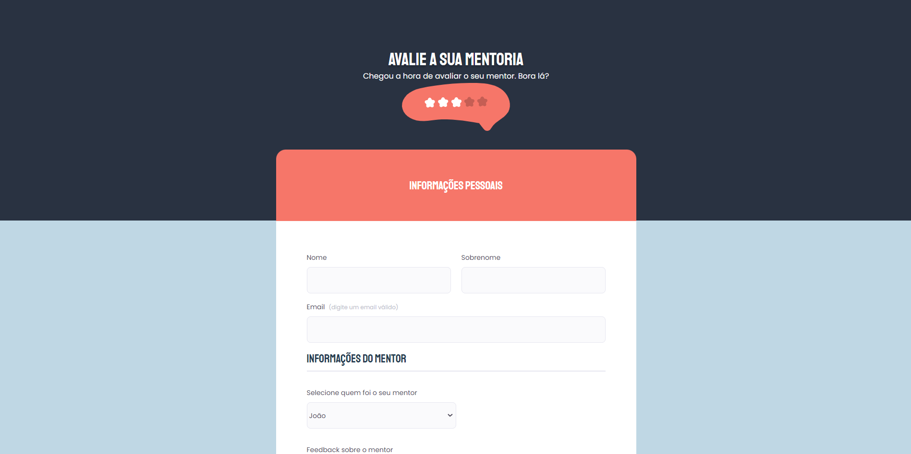

# Desafio Avancado 0.2

## 💻 Sobre

Projeto desenvolvido avançado, disponibilizado pela [Rocketseat](https://www.rocketseat.com.br/), na platamforma do [Figma](https://www.figma.com/file/XyVVyALBQUGuWhewAhY1Fi/Explorer-Stage-03-Projeto-01-(Copy)), em que se consiste em um formulário de avaliação, onde se pode dar o feedback, além de poder escolher data e horários para proximas mentorias.

O mesmo pode ser visualizado no [aqui](https://manuelaalecio.github.io/desafio-avancado-02/).

## 🔨 Tecnologias

* HTML5
* CSS3

## 📄 Licensa

Este projeto está sob a licença do MIT. Consulte o arquivo [LICENSE](LICENSE) para obter mais detalhes.
